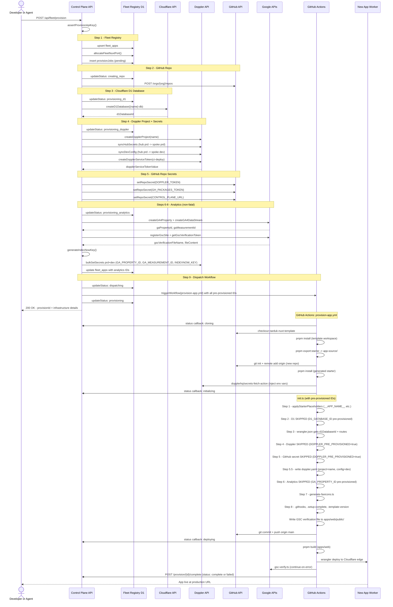
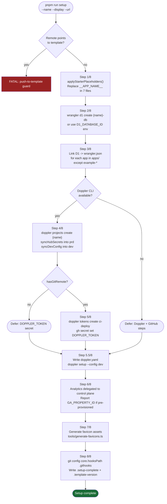
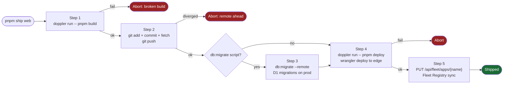
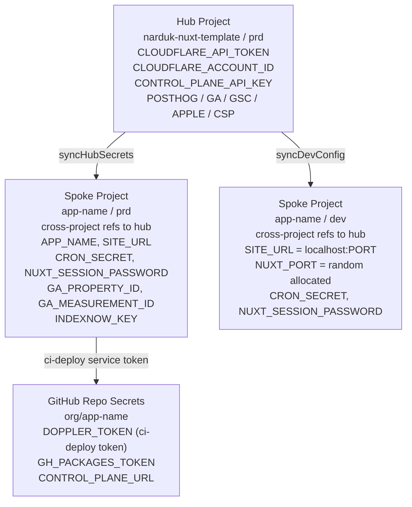

# Provisioning Flow

End-to-end pipeline from a provisioning request to a live, deployed app.

Three phases, each running in a different environment:

| Phase | Where | Trigger |
|-------|-------|---------|
| **A - Control Plane API** | Cloudflare Worker (edge) | POST `/api/fleet/provision` |
| **B - GitHub Actions** | `provision-app.yml` runner | Dispatched by Phase A |
| **C - Local / Developer** | Developer machine | `pnpm run setup` or `pnpm ship` |

---

## Full Provisioning Flow (Control Plane -> GitHub Actions)

---

## Local Developer Setup (`pnpm run setup`)

---

## Ship Flow (`pnpm ship`)

---

## Secret Flow

