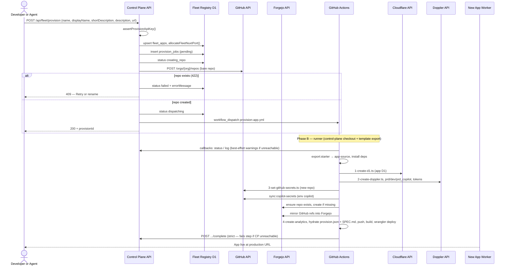
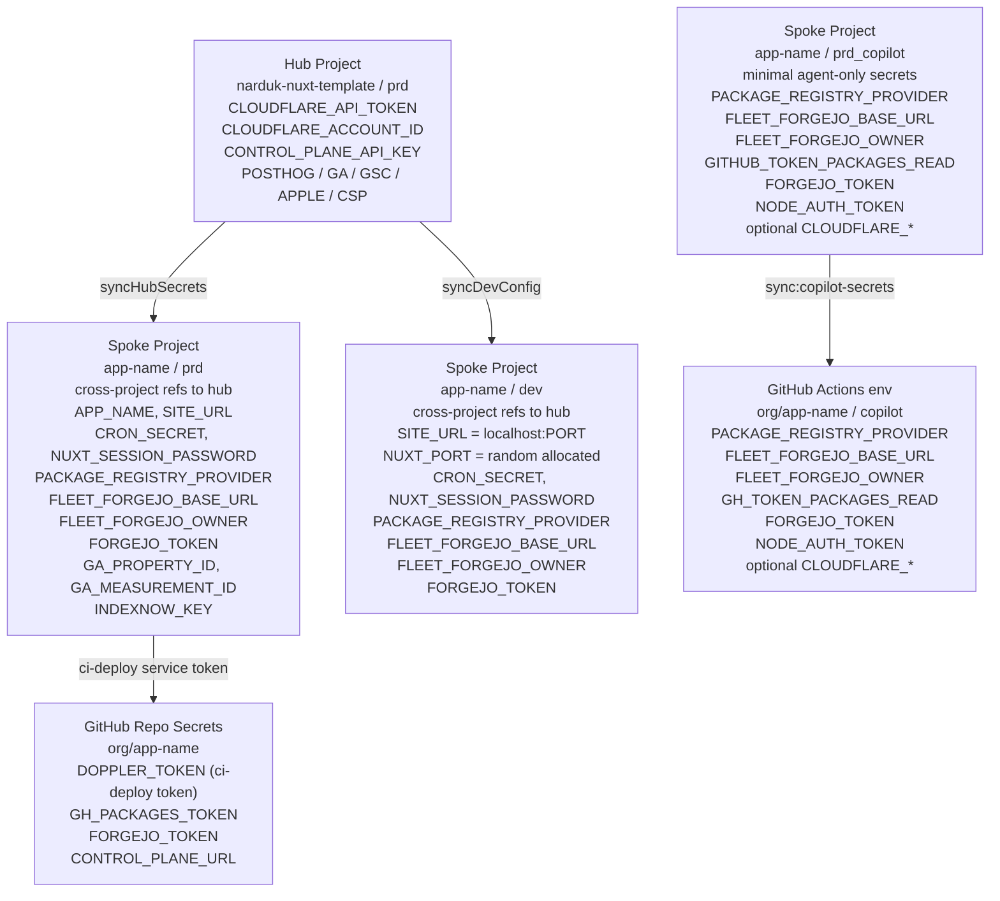

# Provisioning Flow

End-to-end pipeline from a provisioning request to a live, deployed app.

Three phases, each running in a different environment:

| Phase                     | Where                                                     | Trigger                                                      |
| ------------------------- | --------------------------------------------------------- | ------------------------------------------------------------ |
| **A - Control Plane API** | Cloudflare Worker (edge)                                  | `POST /api/fleet/provision`                                  |
| **B - GitHub Actions**    | `provision-app.yml` on `narduk-enterprises/control-plane` | Dispatched from Phase A                                      |
| **C - Local / Developer** | Developer machine                                         | After clone: `doppler run -- pnpm dev`; ship via `pnpm ship` |

---

## Phase A — Control plane (edge)

The API **only**:

1. Upserts `fleet_apps` and persists the incoming long agent brief
2. Allocates `NUXT_PORT`
3. Inserts `provision_jobs` (`pending` → `creating_repo` → `dispatching` or
   `failed`)
4. Persists the GitHub and Forgejo repo slugs plus `repoPrimary='github'`
5. Creates the **empty** GitHub repo under the target org
   (`POST /orgs/{org}/repos`)
6. Dispatches `provision-app.yml` with `workflow_dispatch` inputs (including
   `provision-id`, `app-short-description`, and `app-description`)

**Not** done on the edge: Cloudflare D1 for the **new app**, Doppler spoke
project, GitHub repo secrets on the **new** repo, Forgejo repo creation, GitHub
→ Forgejo mirroring, GA4/GSC/IndexNow, hydration, or deploy. Those run in Phase
B.

### Repository already exists (HTTP 422)

If the repo name already exists on GitHub, Phase A marks the job **failed** and
returns **409**. No workflow is dispatched (avoiding a duplicate run against an
unknown repo state).

**Recovery:** In the control plane UI, use **Retry** on that job. Retry
**re-dispatches** the workflow only; it does not call `POST /orgs/.../repos`
again. Use this when the repo is empty or acceptable to overwrite with
`git push --force` from the pipeline. Otherwise delete the repo or pick a
different app name and start a new provision.

---

## Full flow (sequence)

---

## After provisioning (local dev)

There is no `tools/init.ts` and no `pnpm run setup` for infra. A provisioned
repo already has `.setup-complete`, `doppler.yaml`, and wrangler wired by the
pipeline. It should also already contain `provision.json`, a draft `SPEC.md`,
and a populated GitHub Actions environment `copilot` for GitHub Agentic
Workflows. Clone the new repo, run `pnpm install`,
`doppler setup --project <app> --config dev`, then `doppler run -- pnpm dev`.
See `docs/provisioning-pipeline.md`.

---

## Ship Flow (`pnpm ship`)

---

## Secret Flow

## Operator Runbook

Operators should start with the local [operator runbook](./operator-runbook.md),
then use the template runbook at
[docs/agents/operations.md](https://github.com/narduk-enterprises/narduk-nuxt-template/blob/main/docs/agents/operations.md)
for the downstream repo behavior, especially:

- the provision payload `shortDescription` + long `description`
- the GitHub Actions environment `copilot`
- `pnpm run sync:copilot-secrets`

For long-term drift control in the control plane, use the scheduled/manual
workflow
[`.github/workflows/sync-copilot-secrets.yml`](../.github/workflows/sync-copilot-secrets.yml).
