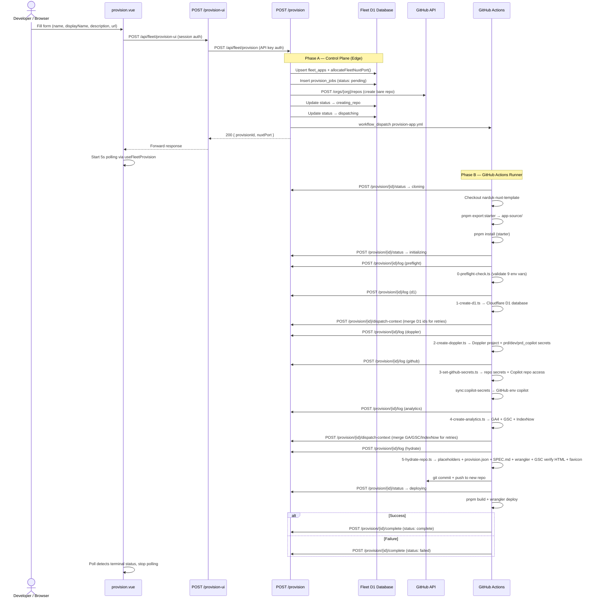
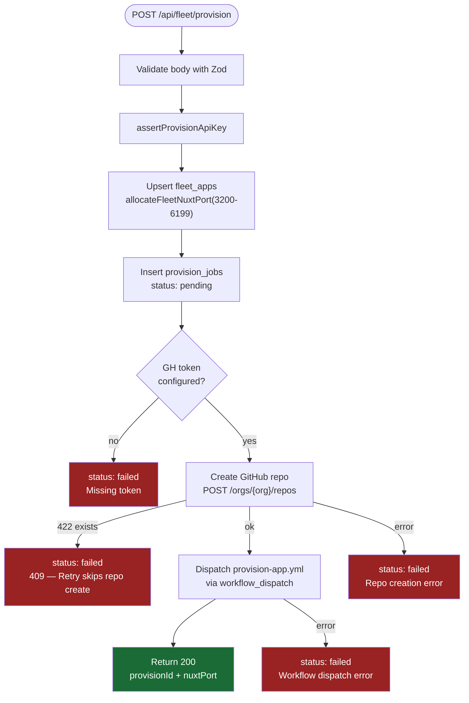
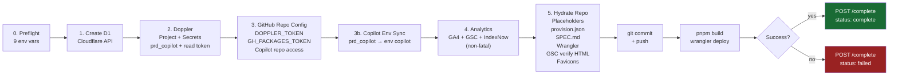
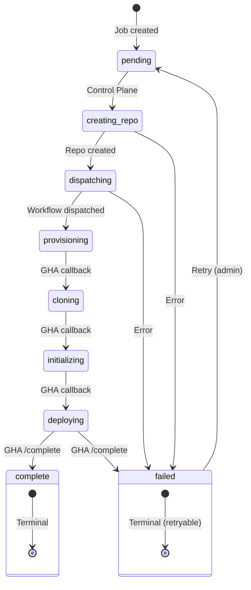
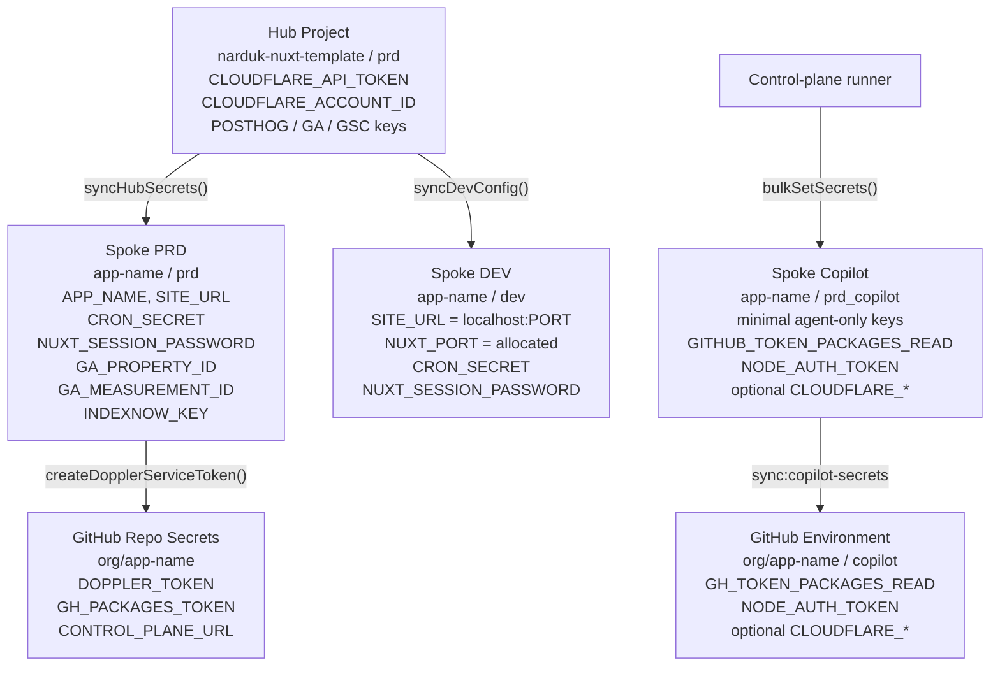
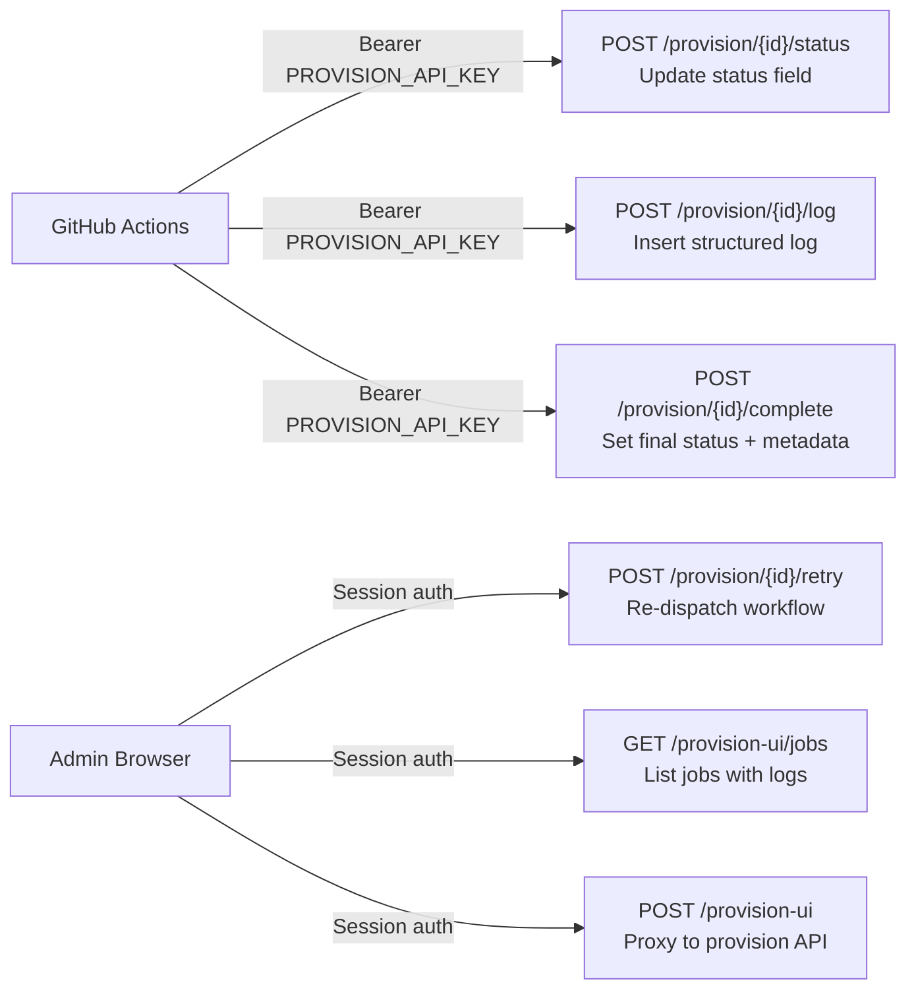

# Provisioning Pipeline

End-to-end flow from browser form submission to a live deployed app.

**Single supported path:** New fleet apps are created only via the **control
plane** (`POST /api/fleet/provision` or the admin UI), which dispatches
**`narduk-enterprises/control-plane`** `.github/workflows/provision-app.yml`.
The read-only template repo **does not** ship a `provision-app.yml` workflow and
**does not** run `tools/init.ts` (removed). `tools/provision/*.ts` plus
`5-hydrate-repo.ts` perform setup on the runner; the hydrate step writes
`.setup-complete`, `provision.json`, and a draft `SPEC.md` so downstream agents
start from persisted product context instead of guessing scope.

## Pipeline Overview

## Provisioning Steps Detail

## GitHub Actions Pipeline Steps

The workflow checks out this repo first so `scripts/provision-cp-callback.sh` is
available. **Status** and **log** calls use that script in `best-effort` mode
(HTTP failures emit `::warning::` in the job log). **Complete** (success or
failure) uses `strict` mode so the step fails if the control plane does not
return 200/201 — avoiding silent “green” runs with a stuck job in D1. Payloads
for `complete` are built with `jq`.

For the `narduk-enterprises/control-plane` repo itself, the workflow should
bootstrap from a single GitHub Actions secret: `DOPPLER_TOKEN`. That token loads
the `control-plane/prd` Doppler config, which then supplies `CONTROL_PLANE_URL`,
`PROVISION_API_KEY`, `CLOUDFLARE_*`, `DOPPLER_API_TOKEN`, GitHub package auth,
and the control-plane GitHub service token for the rest of the run.

## Status Lifecycle

## Secret Flow

## Copilot Environment

Freshly provisioned app repos should have a GitHub Actions environment named
`copilot`. GitHub Agentic Workflows such as downstream
`.github/workflows/provisioned-app-build.md` read their install/build secrets
from that environment, not from chat.

The provisioning runner now:

1. Seeds Doppler `prd_copilot` with the minimal agent secret set.
2. Mints a read-only `prd_copilot` service token for the sync step.
3. Runs
   `pnpm run sync:copilot-secrets -- <app> --doppler-config=prd_copilot --github-repo=<owner>/<repo>`
   to create/update the GitHub environment `copilot`.

For ongoing drift control, use
[`sync-copilot-secrets.yml`](../.github/workflows/sync-copilot-secrets.yml) from
this repo. It supports manual dry runs in staging and a scheduled nightly resync
across active fleet apps. Keep credentials least-privilege:

- Doppler: read-only token scoped to `<app>/prd_copilot`
- GitHub: token allowed to set Actions environment secrets on the target repo

Operators should use the local [operator runbook](./operator-runbook.md) for the
control-plane workflow and hand downstream maintainers the template runbook at
[template docs/agents/operations.md](https://github.com/narduk-enterprises/narduk-nuxt-template/blob/main/docs/agents/operations.md),
especially the sections on provisioning, the `copilot` environment, and
`sync:copilot-secrets`.

## Callback API Routes

